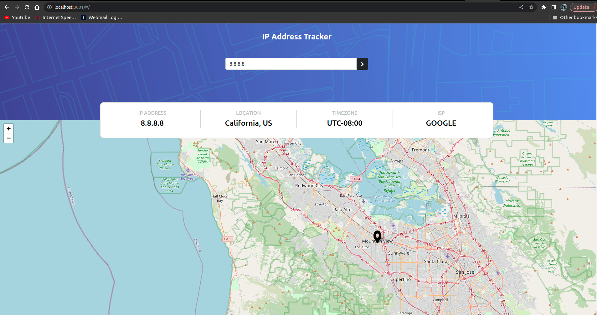

# ip-address-tracker

## Project setup

All you need is docker and docker-compose cli to run this project, run the following command in project root:
```
docker-compose up --build
```

Then navigate to http://localhost:3001:



